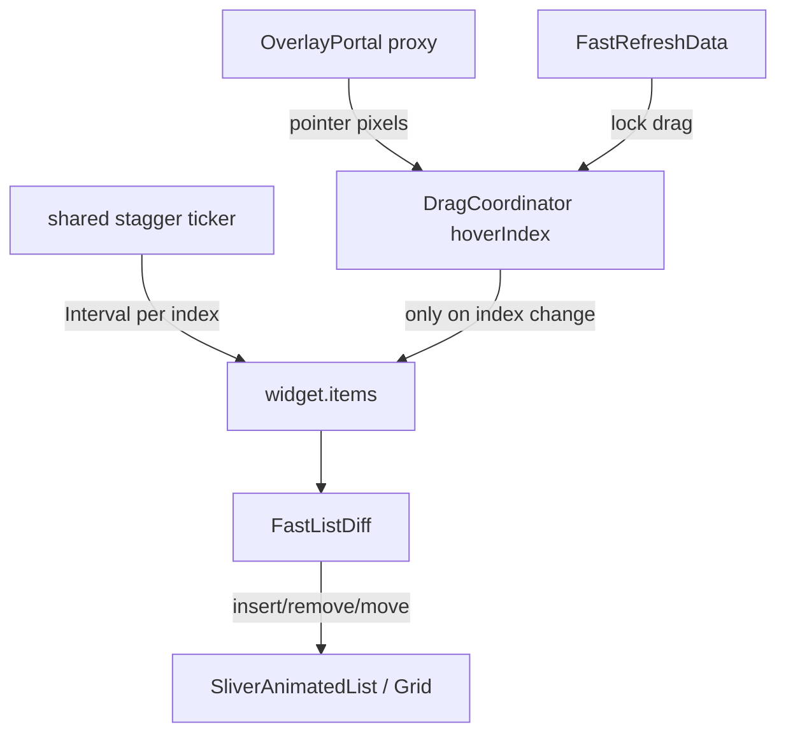

# FastAnimatedCompositeList 设计 Space

给自己改方案用，不上文档站。对外用法见 `docs/ui/animated-list.md`；实现怎么读见同目录 `LEARN.md`。**以当前 `lib` 代码为准。**

入场节奏参考 [flutter_staggered_animations](https://github.com/mobiten/flutter_staggered_animations)，增删走 Flutter `SliverAnimatedList` / `SliverAnimatedGrid`，拖拽手写。对齐 UI Kit：**零第三方依赖、核心手写、主题走 `ThemeExtension`、文档写清「不做」**。

覆盖场景：列表 / 网格首次错开入场、items 变化时的插入 / 删除、长按或手柄拖拽排序、与竖直 FastRefresh / FastSlidable 组合。

## 和参考实现的关系

不把源码拷进仓库。只复用已经验证过的模型：

- 首次露出的 item 按 position 错开 delay（list / grid 公式与参考库相同）
- 第一帧之后滚入视野的 item **不再**播放入场（Limiter）
- 入场可叠加 fade / slide / scale

相对参考库的性能取舍：

- **一个列表级 ticker**，item 用 `Interval` 切片；禁止每个 child 建 `AnimationController`
- 入场组件在 `initState` / `didChangeDependencies` 里捕获「是否播放」，避免 Limiter 翻转时打断第一屏
- 不导出 `SlideAnimation` / `FadeInAnimation` 嵌套包装；入场是枚举 + 可选 `transitionBuilder`

SDK 必须兼容根目录 `pubspec.yaml`：Dart `>=3.3.4`，Flutter `>=3.19.6`。不要用 `Color.withValues`（3.27+），沿用 `withOpacity`。不要用 `AnimatedList.separated`（3.27+）。

## 公开 API：两个独立组件 + 组合入口

```dart
// 1) 只做增删 / 入场
FastAnimatedList<T>(
  items: items,
  itemId: (e) => e.id,
  itemBuilder: (context, item, index) => tile,
  stagger: FastListStagger.list(),
)

// 2) 只做拖拽排序
FastReorderableList<T>(
  items: items,
  itemId: (e) => e.id,
  onReorder: (from, to) { /* Flutter 约定：from < to 时 to-- */ },
  itemBuilder: (context, item, index) => tile,
)

// 3) 组合
FastAnimatedCompositeList<T>(
  items: items,
  itemId: (e) => e.id,
  onReorder: onReorder,
  itemBuilder: (context, item, index) => tile,
)
```

Sliver 变体：`FastSliverAnimatedList` / `FastSliverReorderableList` / `FastSliverAnimatedCompositeList`。网格用 `.grid(gridDelegate: ...)`。

Column / 自建 ListView 只要入场、不要 diff 时用 `FastStagger` + `FastStagger.item`。

## 相对参考库 / SDK 的优化

1. **隐式 items，不手写 insertItem**  
   调用方 `setState` 改列表，核心做 identity diff。超过 `animationBudget` 的大改动（整表刷新）零时长对齐，避免 N 段动画卡死。

2. **拖拽不跟增删抢同一套 sliver**  
   独立组件可以只用 SDK `SliverAnimatedList` 或只用拖拽层。组合入口共用 `_FastListCore`：增删仍走 AnimatedList，拖拽用 Overlay 代理 + `hoverIndex` 通知（**不是每像素重建 item**）。

3. **和 FastRefresh / FastSlidable 共存**  
   默认长按才拖，不跟竖直滚动 / 下拉刷新抢手势。刷新进行中（`userOffsetNotifier` 或 Header / Footer 非 `inactive`）锁拖拽。水平 `FastSlidable` 包在 `itemBuilder` 里即可，不焊进 Paging API。

4. **Controller 生命周期对齐 FastSlidableController**  
   外部传入则调用方 `dispose`；未传入则 State 自建自毁。只暴露 `isAnimating` / `isDragging`，items 仍由调用方持有。

## 已拍板

- `onReorder` 对齐 Flutter `ReorderableListView`：`oldIndex < newIndex` 时先 `newIndex -= 1` 再 `insert`。
- 拖拽触发：`longPress`（默认）或 `handle`（`FastListDragHandle`）。
- 首屏错开默认开启，滚入不再播。
- item 必须稳定且唯一的 `itemId`。

## 不做

- 不移植参考库的 4 个 Animation 包装类和 per-item `AnimationController`
- 不提供 `AnimatedList.separated` 兼容层；分割线放进 tile
- 不把本组件焊进 `FastPagingList` API
- 不做多指拖拽、跨列表拖拽、鼠标 hover 露出手柄
- 不保证水平 Refresh 与水平拖拽同轴共存
- 不做隐式 `==` 当 identity（必须 `itemId`）

## 内部结构



文件在 `lib/src/ui_kit/fast_animated_composite_list/`：

- `fast_animated_composite_list.dart` 入口
- `controller/` `theme/` `animation/` `drag/` `widgets/`
- `LEARN.md`、`SPACE.md`

导出在 `lib/fast_package.dart`。文档 `docs/ui/animated-list.md` + `docs/en/ui/animated-list.md`。示例 `example/lib/pages/animated_list_example/`。测试 `test/fast_animated_composite_list_test/`。
