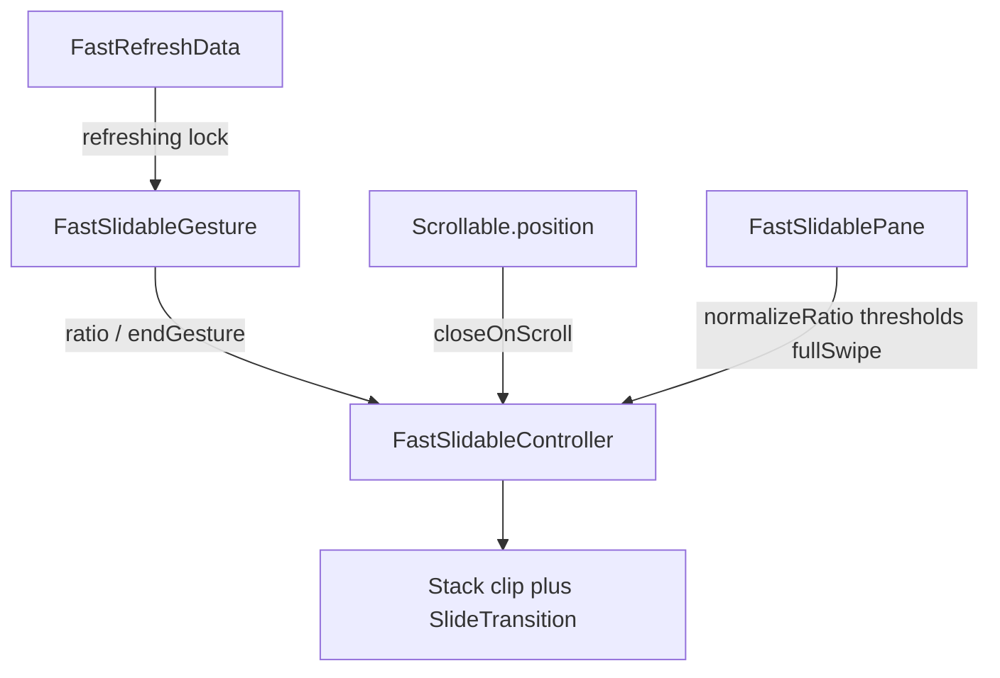

# FastSlidable 设计 Space

给自己改方案用，不上文档站。对外用法见 `docs/ui/slidable.md`；实现怎么读见同目录 `LEARN.md`。**以当前 `lib` 代码为准。**

参考 [flutter_slidable](https://github.com/letsar/flutter_slidable) 的 `ratio` 驱动模型，在本包手写一套。对齐 UI Kit：**零第三方依赖、核心手写、主题走 `ThemeExtension`、文档写清「不做」**。

覆盖场景：列表露出按钮、一滑删除、FastRefresh 组合、程序化开关、iOS 满滑触发主操作、竖直方向、多种 Motion。

## 和 flutter_slidable 的关系

不把源码拷进仓库。MIT 与 BSD-3 兼容，但仓库要求核心手写、行为可审查。只复用已经验证过的模型：

- `ratio` 在 `-1 ~ 1`，符号决定 start / end
- `FastSlidableController` 管动画、松手、打开 / 关闭 / 删除
- `Stack` + clip + `SlideTransition` 叠操作区
- Motion 可替换，只读 `FastSlidable.of` / pane 数据

SDK 必须兼容根目录 `pubspec.yaml`：Dart `>=3.3.4`，Flutter `>=3.19.6`。不要用 `Color.withValues`（3.27+），沿用 `withOpacity`。

## 公开 API

命名跟 Toast / Refresh 一样用 `Fast` 前缀，不沿用 `ActionPane` / `SlidableAction`。

```dart
FastSlidable(
  groupTag: 'inbox',
  controller: controller,          // 可选
  direction: Axis.horizontal,      // 也支持 vertical
  closeOnScroll: true,
  startPane: FastSlidablePane(...),
  endPane: FastSlidablePane(...),
  child: tile,
)

FastSlidablePane(
  motion: FastSlidableMotion.scroll, // behind / drawer / scroll
  extentRatio: 0.4,
  openThreshold: 0.2,
  closeThreshold: 0.2,
  dismiss: FastSlidableDismiss(onDismissed: () {}),
  fullSwipe: FastSlidableFullSwipe(
    threshold: 0.55,
    dismiss: true,                 // 满滑后是否缩行删除
    // 主操作默认：start 第一个 / end 最后一个；可用 primaryIndex 覆盖
  ),
  children: [
    FastSlidableAction(onPressed: ..., icon: Icons.more_horiz, label: '更多'),
    FastSlidableAction(onPressed: ..., icon: Icons.delete, label: '删除'),
  ],
)
```

程序化：`openStart()` / `openEnd()` / `close()` / `dismiss()`，以及 `FastSlidable.of(context)`。

外观：`FastSlidableTheme`（`ThemeExtension`），管默认时长、曲线、动作间距 / 圆角 / 前景色回退。解析顺序与 Toast 相同：入参覆盖 → Theme → light / dark。

组互斥：`FastSlidableGroup` + `groupTag`。同一 tag 同时只开一行；点另一行或打开新行时关闭旧行。

## 相对原库的优化

1. **砍兼容层**  
   不移植旧通知 API。组通信只留 `InheritedWidget` + 内部注册表。

2. **满滑触发做成一等能力**  
   原库用 `dismissible` + 拖过 `extentRatio` 间接触发，和「露出按钮」缠在一起。这里拆成两段：
   - 松手在 `extentRatio` 内：按 open / close 阈值决定展开或收回
   - 拖过 `fullSwipe.threshold`：主操作铺满；松手触发该操作，`dismiss: true` 时再缩行

3. **和 FastRefresh 共存（本包独有）**  
   日常组合：竖直 `FastRefresh` / `FastPagingList` + 水平 `FastSlidable`。
   - Slidable 只注册自己那根轴的拖动手势
   - `closeOnScroll` 监听最近 `Scrollable`，列表一滚就关
   - 刷新进行中（`userOffsetNotifier == true` **或** Header / Footer 非 `inactive`）锁住滑动并关闭当前行
   - **同轴组合不做**：水平 Refresh + 水平 Slidable 不保证手势仲裁
   - 不把 Slidable 焊进 `FastPagingList` API，在 `itemBuilder` 里组合

4. **Controller 生命周期对齐 FastRefreshController**  
   外部传入则调用方 `dispose`；未传入则 State 自建自毁。  
   不把「当前 controller」放进 `late` / `late final` 再重绑（原库 [#523](https://github.com/letsar/flutter_slidable/issues/523)）。生效实例是 `widget.controller ?? _ownedController`：  
   - 换外部实例：只卸本 State 的 listener，**不** dispose（调用方仍持有）  
   - 换掉自建实例：等子组件在 `didUpdateWidget` 卸完 listener，本帧结束再 dispose（立刻 dispose 会让子组件 `removeListener` 打到已销毁的 `AnimationController`）

5. **Motion 用枚举 + 内置实现**  
   `FastSlidableMotion.behind / drawer / scroll`。进阶用 `motionBuilder`，不先公开空 Widget 类。滑动交互不做 stretch。

6. **Dismiss 必须带 Key**  
   配置了 `FastSlidableDismiss` 或会删除的 `fullSwipe` 时，`FastSlidable.key` 为空就 assert。

## 已拍板

- **主操作**：默认 start 第一个 / end 最后一个；pane 上可用 `fullSwipe.primaryIndex` 覆盖。
- **Refresh 锁定**：手指正在下拉，**或** Header / Footer 不是 `inactive`（含 `processing`）都锁。

## 不做

- 不自动从 child 推断按钮、不内置业务图标包
- 不提供 0.6 / 旧通知迁移层
- 不保证水平 Refresh 与水平 Slidable 同轴共存
- 不把 FastSlidable 焊进 `FastPagingList` 的 API
- 不做多指、不做鼠标 hover 露出
- 不做 stretch 露出动画；滑动交互只用 behind / drawer / scroll

## 内部结构



文件在 `lib/src/ui_kit/fast_slidable/`（独立文件分目录，不像 Refresh 做成巨型 `part of`）：

- `fast_slidable.dart` 入口
- `controller/fast_slidable_controller.dart`
- `theme/fast_slidable_theme.dart`
- `motion/fast_slidable_motion.dart`
- `widgets/fast_slidable_widget.dart`
- `widgets/fast_slidable_pane.dart`
- `widgets/fast_slidable_action.dart`
- `widgets/fast_slidable_dismiss.dart`
- `widgets/fast_slidable_group.dart`
- `LEARN.md`、`SPACE.md`

导出在 `lib/fast_package.dart`。文档 `docs/ui/slidable.md` + `docs/en/ui/slidable.md`。示例 `example/lib/pages/slidable_example/`。测试 `test/fast_slidable_test/`。
